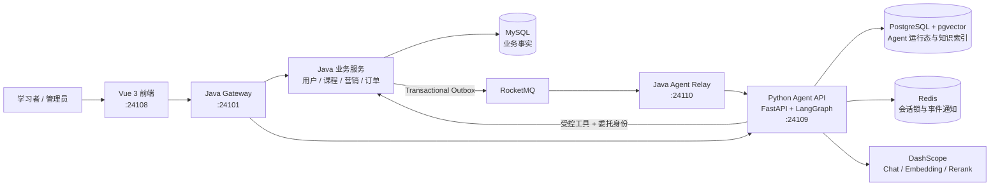

# MyLesson

[](https://github.com/yangaobo0235/my-lesson/actions/workflows/ci.yml)
[](LICENSE)

面向在线学习场景的 Java + Python 双语言 Agent 平台，覆盖课程、营销、订单、学习、智能问答、知识检索和学习计划生成，并通过明确的服务边界保证业务写入可控、可审计、可恢复。

## 核心能力

- 提供用户、角色、课程、营销、订单、购物车、学习和弹幕等完整业务能力。
- 使用 FastAPI 与 LangGraph 编排意图识别、知识检索、工具调用和流式回答。
- 使用 PostgreSQL 与 pgvector 保存对话运行态、知识索引、引用和评测记录。
- 使用 Java 受控工具执行查询与业务写入，Python 不直接修改业务数据库。
- 通过草案确认机制生成学习计划，用户确认后才由 Java 事务创建正式计划。
- 使用 Transactional Outbox、RocketMQ 和 Inbox 实现可靠、幂等的知识同步。
- 通过持久化 SSE、`Last-Event-ID`、任务租约、心跳和超时恢复增强 Agent 运行可靠性。
- 集成 Prometheus、OpenTelemetry 与 Langfuse，记录指标、链路和模型调用。

模型输出只用于建议、检索和候选结果。身份权限、业务规则、正式数据和事务一致性始终由 Java 服务控制。

## 系统架构



## Java 与 Python 职责

| 能力 | 所有者 | 说明 |
| --- | --- | --- |
| 登录、角色、权限、Gateway | Java | 统一身份入口和业务权限 |
| 用户、课程、营销、订单、学习计划 | Java | 业务事实、规则和 MySQL 事务 |
| Agent 受控工具 | Java | 校验委托身份后执行查询或写入 |
| 模型、Prompt、LangGraph 工作流 | Python | 唯一 AI/Agent 运行时 |
| RAG、Embedding、Rerank、评测 | Python | 与模型运行时保持内聚 |
| 对话、Run、SSE、知识索引 | Python/PostgreSQL | Agent 运行数据，不作为业务事实 |
| RocketMQ 到 Python 的事件适配 | Java Relay | 只负责可靠运输，不编排 Agent |

Java 不调用模型、不保存 Prompt、不编排 Agent。Python 不直接修改 MySQL，所有正式业务写入均通过 Java 规则和事务完成。

## Agent 请求流程

```text
用户登录
  -> Gateway 校验登录态并签发短期委托 JWT
  -> Python Agent 分类意图并检索知识
  -> Python 按允许列表选择 Java 工具
  -> Java 同时校验内部令牌和委托身份
  -> Java 执行业务规则或事务
  -> Python 保存回答、引用和事件
  -> 前端通过 SSE 接收结果，断线后可继续回放
```

学习计划不会由 Agent 直接写入正式数据：

```text
Agent 生成候选
  -> Java 创建 WAITING_CONFIRMATION 草案
  -> 用户调整或确认
  -> Java 在 MySQL 事务中创建正式计划
```

## 模块与端口

| 模块 | 端口 | 职责 |
| --- | ---: | --- |
| `ml-gateway` | 24101 | 对外入口、登录态、路由和委托 JWT |
| `ml-user` | 24102 | 用户、角色和权限 |
| `ml-course` | 24103 | 课程、学习计划和 Agent 工具 |
| `ml-sale` | 24104 | 营销内容和秒杀 |
| `ml-order` | 24105 | 订单和购物车 |
| `ml-barrage` | 24106 | 实时弹幕 |
| `ml-web` | 24108 | 学生端、管理端和 AI 助手 |
| `ml-agent-python` | 24109 | FastAPI、LangGraph、RAG、对话和评测 |
| `ml-agent-relay` | 24110 | RocketMQ 到 Python 的知识事件适配 |

## 技术栈

| 分类 | 技术 |
| --- | --- |
| Java 后端 | Java 17、Spring Boot 3.2、Spring Cloud、Spring Cloud Alibaba、MyBatis-Flex |
| Python Agent | Python 3.12、FastAPI、LangGraph、SQLAlchemy、Pydantic |
| 模型与检索 | DashScope、OpenAI Compatible API、pgvector |
| 数据与消息 | MySQL、PostgreSQL、Redis、RocketMQ、Elasticsearch、MinIO |
| 前端 | Vue 3、Vite、Element Plus、ECharts、Vuex |
| 数据库迁移 | Flyway、Alembic |
| 可观测性 | Prometheus、OpenTelemetry、Langfuse |
| 测试与质量 | JUnit、Pytest、Ruff、Mypy、Vitest、GitHub Actions |

## 项目结构

```text
my-lesson/
|-- .github/workflows/       # 持续集成
|-- backend-java/            # Maven 父子工程和 Java 服务
|   |-- ml-common/           # 公共模型、安全和 Outbox
|   |-- ml-gateway/          # API Gateway
|   |-- ml-user/             # 用户和权限
|   |-- ml-course/           # 课程与学习计划
|   |-- ml-sale/             # 营销与秒杀
|   |-- ml-order/            # 订单与购物车
|   |-- ml-barrage/          # 弹幕
|   |-- ml-agent-relay/      # 知识事件 Relay
|   `-- tools/ml-generator/  # 代码生成器
|-- agent-python/            # Python Agent API、Worker 和迁移
|-- frontend/ml-web/         # Vue 3 前端
|-- contracts/               # OpenAPI 与 JSON Schema
|-- deploy/                  # Compose 和环境变量模板
|-- docs/                    # 架构与部署文档
|-- scripts/                 # 契约生成等辅助脚本
|-- pom.xml                  # 工作区 Maven 聚合入口
`-- README.md
```

`demo-data/`、测试报告和验收输出属于本地数据，不进入 Git 仓库。

## 环境要求

- JDK 17
- Maven 3.9+
- Python 3.12
- Node.js 20+ 与 npm
- Docker Compose，可选，用于本地构建应用容器
- MySQL 8
- PostgreSQL 15+ 与 pgvector
- Redis、RocketMQ、Nacos
- 可选：MinIO、Elasticsearch、OpenTelemetry Collector、Langfuse

基础设施可以运行在独立的 Docker 主机上，MyLesson 应用服务可以全部在开发机本地运行。

## 快速开始

### 1. 获取代码

```powershell
git clone https://github.com/yangaobo0235/my-lesson.git
Set-Location my-lesson
```

### 2. 创建本地配置

```powershell
Copy-Item .env.example .env
```

编辑 `.env`，填写本地或独立基础设施地址、数据库账号、模型 API Key 和随机安全令牌。`.env` 已被 Git 忽略，不要提交真实凭据。

Python 从 `agent-python/` 启动时会自动读取仓库根目录 `.env`。Java/Spring 不读取 dotenv 文件；在同一个 PowerShell 终端中载入配置后再启动 Java 服务：

```powershell
Get-Content .env | ForEach-Object {
    if ($_ -match '^\s*([^#][^=]*)=(.*)$') {
        Set-Item -Path "Env:$($matches[1].Trim())" -Value $matches[2]
    }
}
```

### 3. 执行数据库迁移

Java 服务启动时由 Flyway 管理各业务库迁移。Python Agent 使用 Alembic：

```powershell
Set-Location agent-python
python -m venv .venv
.\.venv\Scripts\python -m pip install -e ".[dev]"
.\.venv\Scripts\python -m alembic upgrade head
Set-Location ..
```

### 4. 构建 Java 服务

```powershell
java -version
mvn clean package
```

IntelliJ IDEA 应导入仓库根目录的 `pom.xml`。Windows 本地运行建议设置 `JAVA_TOOL_OPTIONS=-Dfile.encoding=UTF-8`。

### 5. 启动应用

根据需要启动 Java Gateway、业务服务和 Relay。Python Agent API 与 Worker 分别运行：

```powershell
Set-Location agent-python
.\.venv\Scripts\python -m uvicorn mylesson_agent.main:app --reload --port 24109
```

在另一个终端运行：

```powershell
Set-Location agent-python
.\.venv\Scripts\python -m mylesson_agent.worker
```

启动前端：

```powershell
Set-Location frontend/ml-web
npm ci
npm run dev
```

应用容器编排见 `deploy/docker-compose.apps.yml`。它只启动应用服务，并连接已经准备好的基础设施：

```powershell
Copy-Item deploy/env/agent.env.example deploy/env/agent.env
Copy-Item deploy/env/java.env.example deploy/env/java.env
docker compose -f deploy/docker-compose.apps.yml up -d --build
```

模板中的 `infra.example.com` 是占位地址，启动前必须替换为实际基础设施主机名或 IP。

## 访问入口

| 入口 | 地址 |
| --- | --- |
| Web 前端 | `http://localhost:24108` |
| Gateway | `http://localhost:24101` |
| Agent Swagger UI | `http://localhost:24109/docs` |
| Agent OpenAPI | `http://localhost:24109/openapi.json` |
| Agent 就绪检查 | `http://localhost:24109/health/ready` |

## 测试

Java：

```powershell
mvn clean verify
```

Python：

```powershell
Set-Location agent-python
.\.venv\Scripts\python -m ruff check .
.\.venv\Scripts\python -m mypy src
.\.venv\Scripts\python -m pytest
```

前端：

```powershell
Set-Location frontend/ml-web
npm ci
npm test
npm run build
```

CI 会执行 Java 构建与测试、Python lint/typecheck/test、前端依赖审计与构建、OpenAPI 契约漂移检查、Docker 镜像构建和 Compose 配置校验。

## 安全说明

- Gateway 签发短期委托 JWT；Python 公共 API 不信任客户端直接提供的用户身份。
- Java Agent 工具同时校验内部服务令牌和委托身份。
- 工具参数不接受 `userId`，用户 ID 只来自校验后的安全上下文。
- 密码、API Key、支付私钥和令牌只放在本地配置或密钥系统中。
- `.env`、`deploy/env/*.env`、日志、构建产物和本地验收数据不得提交到 Git。
- 生产环境应使用最小权限数据库账号和平台密钥管理能力。
- 安全问题请按照 [SECURITY.md](SECURITY.md) 私下报告。

## 更多文档

- [架构设计](docs/ARCHITECTURE.md)
- [部署说明](docs/DEPLOYMENT.md)
- [Nacos 配置](NACOS_CONFIG.md)
- [Python Agent](agent-python/README.md)
- [Web 前端](frontend/ml-web/README.md)
- [贡献指南](CONTRIBUTING.md)

接口与事件契约位于 `contracts/`：

- `public-agent.openapi.yaml`：前端/Gateway 到 Python Agent
- `internal-tools.openapi.yaml`：Python 到 Java 受控工具
- `knowledge-event.schema.json`：Java Outbox 知识事件

## License

本项目使用 [MIT License](LICENSE)。
