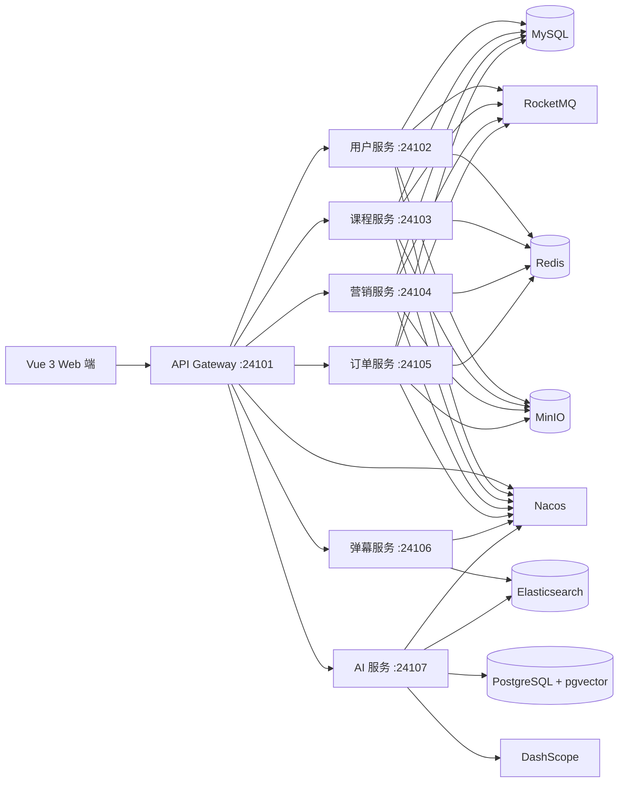

# MyLesson

[](https://github.com/yangaobo0235/my-lesson/actions/workflows/ci.yml)


[](LICENSE)

MyLesson 是一个面向在线教育场景的微服务平台，包含课程内容、用户体系、营销活动、购物车、订单支付、弹幕互动、后台管理和 AI 学习助手等模块。

系统采用 Spring Cloud Alibaba 拆分业务服务，由网关统一接入请求；前端由 Vue 3 Web 端统一承载课程、用户、营销、订单和 AI 工作台。AI 服务作为独立微服务接入课程、订单、用户和营销数据，提供课程问答、选课推荐、学习计划、知识库同步和受控工具调用能力。

## 功能范围

### 用户与权限

- 账号密码登录、手机号验证码登录、注册和 Token 管理
- 用户资料、头像、手机号、密码和角色维护
- 后台用户、角色、菜单和权限配置

### 课程与学习

- 课程分类、课程、季度、分集和媒资管理
- 课程检索、课程详情、收藏、评论、回复和举报
- 分集视频播放、学习记录和 WebSocket 弹幕

### 营销与交易

- 公告、文章、Banner、优惠券和秒杀活动
- 购物车、订单、订单明细、支付宝沙箱支付和支付回调
- 秒杀库存缓存、异步下单和订单状态流转

### AI 学习助手

- 流式 AI 会话、历史消息和会话摘要记忆
- 课程知识问答、混合检索、引用生成和引用校验
- 根据学习目标生成课程推荐，并结合课程详情、资料文章、用户资料、已购课程和购物车状态
- 学习计划草案、用户确认、正式计划、进度更新和调整建议
- 业务工具调用，写操作进入确认流程后再执行
- 课程、文章、公告等业务数据增量同步到知识库
- 管理端查看知识源状态、失败重试、Tool 调用审计和 RAG 评测结果

## 系统架构



## 模块说明

| 模块 | 默认端口 | 说明 |
| --- | ---: | --- |
| `ml-gateway` | 24101 | 统一入口、路由转发、跨域处理和身份透传 |
| `ml-user` | 24102 | 用户、角色、菜单、登录注册、短信验证码和资料管理 |
| `ml-course` | 24103 | 课程、分类、分集、媒资、学习记录、评论和检索 |
| `ml-sale` | 24104 | 公告、文章、Banner、优惠券和秒杀活动 |
| `ml-order` | 24105 | 购物车、订单、订单明细、支付和支付回调 |
| `ml-barrage` | 24106 | WebSocket 弹幕与 Elasticsearch 存储 |
| `ml-ai` | 24107 | AI 会话、RAG、工具调用、学习计划、知识同步和评测 |
| `ml-common` | - | 通用模型、异常、工具类、鉴权上下文和服务间契约 |
| `ml-generator` | - | MyBatis-Flex 代码生成工具 |
| `ml-web` | 24108 | Vue 3 + Element Plus Web 前端 |

## 技术栈

| 分类 | 技术 |
| --- | --- |
| 后端 | Java 17、Spring Boot 3.2.5、Spring Cloud 2023.0.1 |
| 微服务 | Spring Cloud Alibaba、Nacos、OpenFeign、Sentinel |
| AI 应用 | Spring AI 1.1.2、Spring AI Alibaba 1.1.2.2、DashScope、ReactAgent |
| 数据访问 | MyBatis-Flex、Flyway、MySQL、PostgreSQL、pgvector |
| 搜索与缓存 | Elasticsearch、Redis、Redisson |
| 消息与任务 | RocketMQ、XXL-JOB |
| 文件与观测 | MinIO、Micrometer Tracing、Zipkin |
| 第三方服务 | 阿里云短信认证、支付宝沙箱 |
| 前端 | Vue 3、Vite、Element Plus、ECharts |
| 工程化 | Maven、npm、GitHub Actions |

## AI 服务

`ml-ai` 是平台中的独立业务服务，通过内部接口读取课程、订单、用户和营销数据。它不直接修改其他服务的数据，所有会改变业务状态的 Tool 都会生成确认任务，确认通过后再调用对应业务服务。

主要流程：

```text
用户输入
 -> 意图识别
 -> 检索课程知识或选择业务工具
 -> 生成回答、推荐或计划草案
 -> 写操作创建确认任务
 -> 用户确认后执行
 -> 记录消息、引用、Tool 调用和评测数据
```

知识库同步流程：

```text
业务数据变更
 -> Outbox 事件
 -> RocketMQ
 -> AI 服务消费事件
 -> 拉取业务详情
 -> 文档切分
 -> 写入 Elasticsearch / pgvector
 -> 更新知识源状态
```

## 快速开始

### 1. 环境要求

- JDK 17
- Maven 3.9+
- Node.js 20+
- MySQL 8.x
- PostgreSQL 15+ 与 pgvector 扩展
- Redis 6+
- Nacos 2.x
- RocketMQ 4.x
- Elasticsearch 8.x
- MinIO

Sentinel、Zipkin、XXL-JOB、阿里云短信和支付宝沙箱可按需要启用。

### 2. 克隆项目

```bash
git clone https://github.com/yangaobo0235/my-lesson.git
cd my-lesson
```

### 3. 配置环境变量

复制环境变量模板，并将占位值替换为自己的开发环境配置：

```bash
cp .env.example .env
```

Windows PowerShell：

```powershell
Copy-Item .env.example .env
```

常用配置项：

```dotenv
NACOS_SERVER_ADDR=127.0.0.1:8848
MYSQL_USERNAME=root
MYSQL_PASSWORD=your-password

AI_DATASOURCE_URL=jdbc:postgresql://127.0.0.1:5432/mylesson_ai
AI_DATASOURCE_USERNAME=postgres
AI_DATASOURCE_PASSWORD=your-password
DASHSCOPE_API_KEY=your-api-key

AI_IDENTITY_SECRET=your-random-secret
AI_INTERNAL_TOKEN=your-another-random-token
```

`.env` 不会被 Spring Boot 自动读取。可以在启动配置、操作系统环境变量或容器编排文件中注入这些配置。

不要提交 `.env`、AccessKey、API Key、数据库密码、支付宝私钥或其他真实凭据。

### 4. 导入 Nacos 配置

在 Nacos 中创建分组 `ml-group`，并添加以下 Data ID。完整配置模板见 [NACOS_CONFIG.md](NACOS_CONFIG.md)。

| Data ID | 对应服务 |
| --- | --- |
| `common-config.yaml` | 公共数据库、缓存、链路追踪等配置 |
| `ml-gateway-dev.yaml` | 网关 |
| `ml-user-dev.yaml` | 用户服务 |
| `ml-course-dev.yaml` | 课程服务 |
| `ml-sale-dev.yaml` | 营销服务 |
| `ml-order-dev.yaml` | 订单服务 |
| `ml-ai-dev.yaml` | AI 服务 |

配置中的密码和密钥建议继续使用 `${ENV_NAME}` 占位符，由运行环境提供真实值。

### 5. 初始化数据库

Flyway 迁移会随服务启动自动执行。首次运行前需要创建业务数据库，并为 AI 数据库启用 pgvector：

```sql
CREATE DATABASE mylesson_ai;
```

```sql
CREATE EXTENSION IF NOT EXISTS vector;
```

### 6. 启动后端服务

构建全部模块：

```bash
mvn clean package -DskipTests
```

建议按以下顺序启动：

1. `GatewayApplication`
2. `UserApplication`
3. `CourseApplication`
4. `SaleApplication`
5. `OrderApplication`
6. `BarrageApplication`
7. `AiApplication`

也可以从命令行启动单个模块：

```bash
mvn -pl ml-gateway -am spring-boot:run
mvn -pl ml-user -am spring-boot:run
mvn -pl ml-course -am spring-boot:run
mvn -pl ml-sale -am spring-boot:run
mvn -pl ml-order -am spring-boot:run
mvn -pl ml-barrage -am spring-boot:run
mvn -pl ml-ai -am spring-boot:run
```

### 7. 启动 Web 前端

```bash
cd ml-web
npm ci
npm run dev
```

默认访问地址：`http://localhost:24108`

## 测试与构建

运行后端测试：

```bash
mvn test
```

构建 Web 前端：

```bash
cd ml-web
npm ci
npm run build
```

GitHub Actions 会在 Push 和 Pull Request 时执行后端构建与管理端构建。

## 项目结构

```text
my-lesson/
├── .github/workflows/   # CI 工作流
├── ml-ai/               # AI 服务
├── ml-barrage/          # 弹幕服务
├── ml-common/           # 公共模块
├── ml-course/           # 课程服务
├── ml-gateway/          # API 网关
├── ml-generator/        # 代码生成器
├── ml-order/            # 订单服务
├── ml-sale/             # 营销服务
├── ml-user/             # 用户服务
├── ml-web/              # Vue Web 前端
├── .env.example         # 环境变量示例
├── NACOS_CONFIG.md      # Nacos 配置模板
└── pom.xml              # Maven 聚合工程
```

## 安全说明

- 开发、测试和生产环境必须使用不同的密钥。
- `AI_IDENTITY_SECRET` 与 `AI_INTERNAL_TOKEN` 必须使用两个不同的高强度随机值。
- 支付回调地址必须是支付宝可访问的公网 HTTPS 地址。
- 云账号 AccessKey 应使用最小权限 RAM 用户。
- 生产环境应关闭验证码、Token、支付参数等敏感调试日志。
- 生产部署前需要结合实际数据量补充容量评估、安全审计和容灾设计。

## License

本项目基于 [MIT License](LICENSE) 开源。
