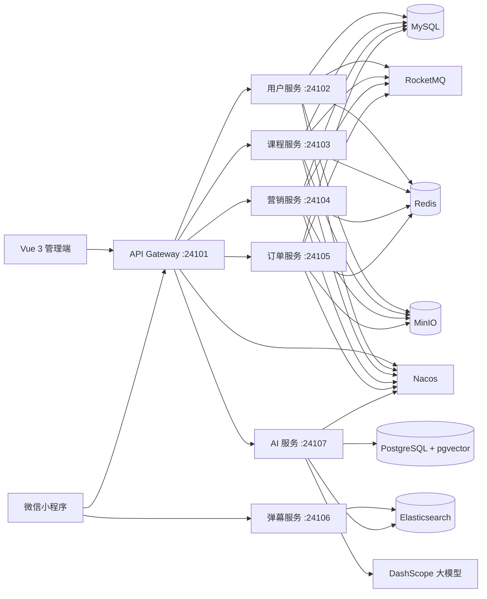

# MyLesson

[](https://github.com/yangaobo0235/my-lesson/actions/workflows/ci.yml)


[](LICENSE)

MyLesson 是一个面向在线教育场景的微服务与 AI Agent 实践项目。系统覆盖用户、课程、营销、交易、弹幕和运营管理等核心业务，并基于 Spring AI Alibaba 构建智能问答、混合检索、工具调用与学习计划工作流。

本项目重点展示 Java 后端、微服务治理、业务系统设计以及 AI 应用工程化能力。

> 项目主体开发周期：2025.07 - 2025.11。当前仓库为整理后的展示版本，已移除本地 IDE 配置、测试源码、生成依赖、私有配置和敏感凭据。
## 项目亮点

- **完整业务闭环**：覆盖注册登录、课程检索、购物车、订单、支付、优惠券、学习记录和弹幕互动。
- **AI Agent**：使用 Spring AI Alibaba Agent Framework 与 DashScope，实现意图路由、知识问答和业务工具调用。
- **RAG 检索增强**：结合 Elasticsearch 与 pgvector 完成关键词、向量混合检索，并接入 Rerank 提升结果质量。
- **学习计划工作流**：支持计划生成、状态流转、人工确认与审批记录。
- **数据一致性设计**：业务服务通过 Outbox 表记录知识变更，由 AI 服务增量同步和索引。
- **微服务治理**：集成 Nacos、Sentinel、OpenFeign、RocketMQ、Zipkin 和 XXL-JOB。
- **多端交付**：提供 Vue 3 管理端与微信小程序端。
- **工程保障**：使用 Flyway 管理数据库变更，并通过 GitHub Actions 执行后端与前端构建。

## 系统架构



## 模块说明

| 模块 | 默认端口 | 说明 |
| --- | ---: | --- |
| `ml-gateway` | 24101 | 统一入口、路由转发、身份校验和跨域处理 |
| `ml-user` | 24102 | 用户、角色、菜单、登录注册与短信验证 |
| `ml-course` | 24103 | 课程、分类、媒资、学习记录与课程搜索 |
| `ml-sale` | 24104 | 优惠券、促销活动和营销业务 |
| `ml-order` | 24105 | 购物车、订单、支付宝沙箱支付和支付回调 |
| `ml-barrage` | 24106 | WebSocket 弹幕与 Elasticsearch 存储 |
| `ml-ai` | 24107 | Agent、RAG、知识库、会话和学习计划 |
| `ml-common` | - | 通用模型、异常、工具类和服务间契约 |
| `ml-generator` | - | MyBatis-Flex 代码生成工具 |
| `ml-web` | 24108 | Vue 3 + Element Plus 管理端 |
| `ml-miniapp` | - | 微信小程序用户端 |

## 技术栈

| 分类 | 技术 |
| --- | --- |
| 后端 | Java 17、Spring Boot 3.2.5、Spring Cloud 2023.0.1 |
| 微服务 | Spring Cloud Alibaba、Nacos、OpenFeign、Sentinel |
| AI 应用 | Spring AI 1.1.2、Spring AI Alibaba 1.1.2.2、DashScope、ReactAgent |
| 数据访问 | MyBatis-Flex、Flyway、MySQL、PostgreSQL、pgvector |
| 搜索与缓存 | Elasticsearch、Redis、Redisson |
| 消息与任务 | RocketMQ、XXL-JOB |
| 文件与可观测性 | MinIO、Micrometer Tracing、Zipkin |
| 第三方服务 | 阿里云短信认证、支付宝沙箱 |
| 前端 | Vue 3、Vite、Element Plus、ECharts、Vant Weapp |
| 工程化 | Maven、npm、GitHub Actions |

## AI 能力

`ml-ai` 不只是简单的大模型接口封装，主要包含以下工程能力：

- 基于规则与模型的意图识别和路由决策。
- ReactAgent 工具调用及只读、写操作权限边界。
- 会话记忆、上下文管理和 SSE 流式响应。
- Elasticsearch 与 pgvector 混合召回。
- DashScope Rerank 排序与降级处理。
- 课程、订单、用户等业务数据的知识化同步。
- 学习计划生成、确认、审批及状态流转。
- 工具调用审计、超时控制、重试和异常兜底。

## 快速开始

### 1. 环境要求

- JDK 17
- Maven 3.9+
- Node.js 20+
- MySQL 8.x
- PostgreSQL 15+ 与 pgvector 扩展
- Redis 6+
- Nacos 2.x
- RocketMQ 4.x
- Elasticsearch 8.x
- MinIO

Sentinel、Zipkin、XXL-JOB、阿里云短信和支付宝沙箱可按需要启用。

### 2. 克隆项目

```bash
git clone https://github.com/yangaobo0235/my-lesson.git
cd my-lesson
```

### 3. 配置环境变量

复制环境变量模板，并将占位值替换为自己的开发环境配置：

```bash
cp .env.example .env
```

Windows PowerShell：

```powershell
Copy-Item .env.example .env
```

重点配置项如下：

```dotenv
NACOS_SERVER_ADDR=127.0.0.1:8848
MYSQL_USERNAME=root
MYSQL_PASSWORD=your-password

AI_DATASOURCE_URL=jdbc:postgresql://127.0.0.1:5432/mylesson_ai
AI_DATASOURCE_USERNAME=postgres
AI_DATASOURCE_PASSWORD=your-password
DASHSCOPE_API_KEY=your-api-key

AI_IDENTITY_SECRET=your-random-secret
AI_INTERNAL_TOKEN=your-another-random-token
```

> `.env` 不会被 Spring Boot 自动读取。使用 IntelliJ IDEA 时可通过 EnvFile 插件加载；也可以在启动配置、操作系统或容器编排文件中注入这些变量。

不要提交 `.env`、AccessKey、API Key、数据库密码、支付宝私钥或其他真实凭据。

### 4. 导入 Nacos 配置

在 Nacos 中创建分组 `ml-group`，并添加以下 Data ID。完整配置模板见 [NACOS_CONFIG.md](NACOS_CONFIG.md)。

| Data ID | 对应服务 |
| --- | --- |
| `common-config.yaml` | 公共数据库、缓存、链路追踪等配置 |
| `ml-gateway-dev.yaml` | 网关 |
| `ml-user-dev.yaml` | 用户服务 |
| `ml-course-dev.yaml` | 课程服务 |
| `ml-sale-dev.yaml` | 营销服务 |
| `ml-order-dev.yaml` | 订单服务 |
| `ml-ai-dev.yaml` | AI 服务 |

配置文件中的密码和密钥应继续使用 `${ENV_NAME}` 占位符，由运行环境提供真实值，不要把真实密钥写入 Nacos 导出文件或 Git 仓库。

### 5. 初始化数据库

项目中的 Flyway 迁移会随服务启动自动执行。首次运行前需要先创建对应数据库，并为 AI 数据库启用 pgvector：

```sql
CREATE DATABASE mylesson_ai;
```

```sql
CREATE EXTENSION IF NOT EXISTS vector;
```

### 6. 构建后端

```bash
mvn clean package -DskipTests
```

建议按以下顺序启动服务：

1. `GatewayApplication`
2. `UserApplication`
3. `CourseApplication`
4. `SaleApplication`
5. `OrderApplication`
6. `BarrageApplication`
7. `AiApplication`

也可以从命令行启动单个模块：

```bash
mvn -pl ml-gateway -am spring-boot:run
mvn -pl ml-user -am spring-boot:run
mvn -pl ml-course -am spring-boot:run
mvn -pl ml-sale -am spring-boot:run
mvn -pl ml-order -am spring-boot:run
mvn -pl ml-barrage -am spring-boot:run
mvn -pl ml-ai -am spring-boot:run
```

### 7. 启动管理端

```bash
cd ml-web
npm ci
npm run dev
```

默认访问地址：`http://localhost:24108`

### 8. 启动微信小程序

1. 使用微信开发者工具导入 `ml-miniapp`。
2. 执行“工具 -> 构建 npm”。
3. 根据本地环境修改小程序请求地址。
4. 开发阶段在微信开发者工具中配置合法域名校验；正式发布时使用已备案的 HTTPS 域名。

## 测试与构建

构建全部后端模块：

```bash
mvn -DskipTests package
```

构建管理端：

```bash
cd ml-web
npm ci
npm run build
```

GitHub Actions 会在 Push 和 Pull Request 时自动执行后端打包与管理端构建。

## 项目结构

```text
my-lesson/
├── .github/workflows/   # CI 工作流
├── ml-ai/               # AI Agent 与 RAG
├── ml-barrage/          # 弹幕服务
├── ml-common/           # 公共模块与演示数据
├── ml-course/           # 课程服务
├── ml-gateway/          # API 网关
├── ml-generator/        # 代码生成器
├── ml-miniapp/          # 微信小程序
├── ml-order/            # 订单服务
├── ml-sale/             # 营销服务
├── ml-user/             # 用户服务
├── ml-web/              # Vue 管理端
├── .env.example         # 环境变量示例
├── NACOS_CONFIG.md      # Nacos 配置模板
├── PROJECT_TIMELINE.md  # 项目阶段时间线
└── pom.xml              # Maven 聚合工程
```

## 安全说明

- 开发、测试和生产环境必须使用不同的密钥。
- `AI_IDENTITY_SECRET` 与 `AI_INTERNAL_TOKEN` 必须使用两个不同的高强度随机值。
- 支付回调地址必须是支付宝可访问的公网 HTTPS 地址。
- 云账号 AccessKey 权限过大，正式环境应使用最小权限 RAM 用户。
- 生产环境应关闭验证码、Token、支付参数等敏感调试日志。
- 当前配置与依赖以学习和作品展示为目标，生产部署前仍需完成容量评估、安全审计和容灾设计。

## 贡献

欢迎通过 Issue 提交问题或改进建议。提交代码前请确保：

```bash
mvn test
cd ml-web && npm run build
```

## License

本项目基于 [MIT License](LICENSE) 开源。
