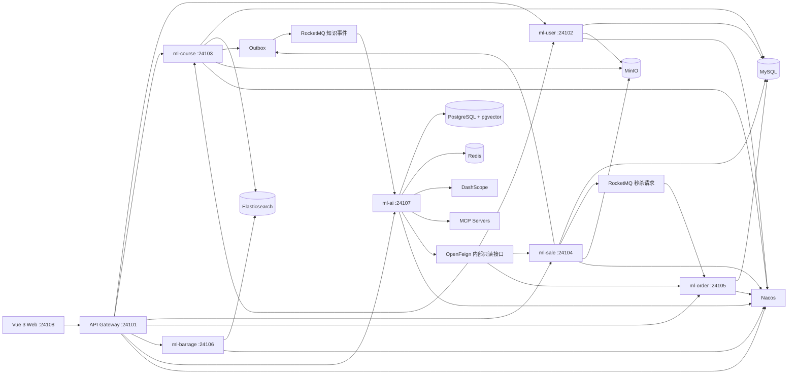

# MyLesson

[](https://github.com/yangaobo0235/my-lesson/actions/workflows/ci.yml)


[](LICENSE)

MyLesson 是一个在线教育微服务项目，覆盖课程内容、用户权限、营销活动、购物车、订单支付、弹幕互动、后台管理和 AI 学习助手等业务场景。

项目主体采用 Spring Cloud Alibaba 微服务架构，由网关统一入口，业务服务按用户、课程、营销、订单、弹幕和 AI 能力拆分；前端使用 Vue 3 + Element Plus 构建统一管理端和学习端。`ml-ai` 作为独立 AI 服务接入课程、用户、订单和营销数据，围绕 Profile 路由的 ReActAgent、有限修正 Graph、混合 RAG 和受控 Tool Calling 提供智能学习助手能力。

## 核心能力

- 在线教育业务闭环：课程、学习、营销、购物车、订单、支付和弹幕互动。
- 微服务统一治理：网关入口、Nacos 配置注册、OpenFeign 服务调用和内部身份透传。
- AI 学习助手：流式对话、课程问答、课程推荐、学习计划、知识库同步和管理端评测。
- Agent 路由：按意图选择知识问答、课程推荐、个人查询或学习计划 Profile，并分配最小 Tool 白名单。
- Graph 工作流：学习计划由 Designer/Reviewer 双角色协作，经真实条件边、一次检索改写和最多两次修正稳定退出。
- 工具治理：本地业务 Tool 区分只读与受控写，分别限制调用次数、超时和重试；MCP 仅作为默认关闭的可选扩展。
- 审批保护：涉及业务状态变更的 AI 操作先生成确认任务，用户确认后再执行。

## 功能概览

### 用户与权限

- 账号密码登录、手机号验证码登录、注册和 Token 管理
- 用户资料、头像、手机号、密码和角色维护
- 后台用户、角色、菜单和权限配置
- 网关鉴权、身份透传和服务间内部调用校验

### 课程与学习

- 课程分类、课程、季、分集和媒资管理
- 课程检索、详情展示、收藏、评论、回复和举报
- 分集视频播放、学习记录和 WebSocket 弹幕
- 课程、季和分集变更后通过 Outbox + RocketMQ 增量同步到 AI 知识库

### 营销与交易

- 公告、文章、Banner、优惠券和秒杀活动管理
- 购物车、订单、订单明细、支付宝沙箱支付和支付回调
- Redis Lua 原子校验资格并扣减秒杀库存，Redisson 控制入口热点并发，RocketMQ 同步确认投递异步下单请求
- 稳定 `requestId`、消费幂等表和发送失败幂等返还，防止重复请求创建多笔订单或永久丢失库存
- 文章和公告变更后通过 Outbox + RocketMQ 增量同步到 AI 知识库
- 订单、课程、用户等数据通过内部接口供 AI 服务只读查询

### AI 学习助手

- 流式 AI 会话、有限历史窗口、权威业务状态和持久化运行时间线
- 双模型 Agent：`qwen3-max` 负责主对话与工具调用，`qwen-flash` 负责低时延意图路由
- Spring AI Alibaba Graph 条件工作流与 Designer/Reviewer 有界协作
- ReActAgent 与学习计划 Graph 共用 Redis Checkpoint，支持执行状态跨进程保留
- Profile 驱动的单一 ReAct 执行入口，低置信度请求自动收敛到只读知识问答能力
- 可选 MCP 外部工具接入，默认关闭，支持启停、白名单、黑名单、超时和审计
- PostgreSQL/pgvector 向量召回与 Elasticsearch 课程关键词召回，经 RRF 融合、DashScope rerank 和引用校验后生成答案
- 工具审计记录来源、读写类型、耗时、请求/响应 Hash、错误码及 MCP 服务信息
- 版本化学习计划草案、Reviewer 问题、V1/V2 用户调整、CAS 确认、正式计划和进度更新
- 写操作进入审批流程，用户确认后再执行实际业务调用
- 知识库支持全量重建，以及带 eventId 幂等、版本控制、失败重试、指标观测和定时对账的增量同步
- 60 条评测数据支持 deterministic CI 基线和 external 手动执行，输出 JSON/Markdown 失败明细

## 系统架构



## 模块说明

| 模块 | 默认端口 | 说明 |
| --- | ---: | --- |
| `ml-gateway` | 24101 | 统一入口、路由转发、跨域处理、鉴权和身份透传 |
| `ml-user` | 24102 | 用户、角色、菜单、登录注册、短信验证码和资料管理 |
| `ml-course` | 24103 | 课程、分类、分集、媒资、学习记录、评论和 Elasticsearch 课程检索 |
| `ml-sale` | 24104 | 公告、文章、Banner、优惠券、秒杀及知识事件生产 |
| `ml-order` | 24105 | 购物车、订单、订单明细、支付宝沙箱支付和回调 |
| `ml-barrage` | 24106 | WebSocket 弹幕和 Elasticsearch 弹幕存储 |
| `ml-ai` | 24107 | AI 会话、混合 RAG、Profile 路由 Agent、条件 Graph、本地 Tool、学习计划和评测；MCP 为可选扩展 |
| `ml-common` | - | 通用模型、异常、工具类、鉴权上下文和服务间契约 |
| `ml-generator` | - | MyBatis-Flex 代码生成工具 |
| `ml-web` | 24108 | Vue 3 + Element Plus Web 前端 |

## 技术栈

| 分类 | 技术 |
| --- | --- |
| 后端基础 | Java 17、Maven、Spring Boot、Spring Cloud |
| 微服务 | Spring Cloud Alibaba、Nacos、OpenFeign、Sentinel |
| AI 应用 | Spring AI 1.1.2、Spring AI Alibaba 1.1.2.2、DashScope、ReactAgent（ReAct）、Graph；可选 MCP Client |
| 数据访问 | MyBatis-Flex、Flyway、MySQL、PostgreSQL、pgvector |
| 搜索与缓存 | Elasticsearch、Redis、Redisson |
| 消息与任务 | RocketMQ、XXL-JOB |
| 文件与观测 | MinIO、Micrometer、OpenTelemetry、Prometheus、Zipkin |
| 第三方服务 | 阿里云短信认证、支付宝沙箱 |
| 前端 | Vue 3、Vite、Element Plus、Vue Router、Vuex、ECharts、xgplayer |
| 工程化 | GitHub Actions、npm、Maven |

说明：`ml-ai` 当前使用独立 POM，版本线为 Spring Boot `3.5.10`、Spring Cloud `2025.0.0`、Spring Cloud Alibaba `2025.0.0.0`；其他业务服务由根 POM 统一管理，版本线为 Spring Boot `3.2.5`、Spring Cloud `2023.0.1`、Spring Cloud Alibaba `2023.0.1.0`。

## AI 服务设计

`ml-ai` 不直接修改其他业务服务的数据。所有会改变业务状态的工具调用都会先生成审批任务，用户确认后再通过内部 Feign 接口调用对应业务服务。

### 双模型与工具边界

- 主对话和 ReactAgent 使用 `qwen3-max`，意图分类显式使用 `qwen-flash`；两者可分别通过 `AI_CHAT_MODEL`、`AI_ROUTER_MODEL` 覆盖。
- 本地 Tool 是主执行链路，按只读和受控写入分类；只读瞬时超时最多重试一次，写 Tool 不做无状态重试。MCP 工具使用 `mcp_` 前缀作为可选扩展。
- 模型调用与 Tool 调用分别计数，并使用独立的 `maxModelCalls`、`maxToolCalls`、读写超时预算。
- 每次工具调用写入 `ai_tool_call`，保存工具来源、读写类型、耗时、请求/响应 SHA-256 Hash、状态和错误码。

### 会话执行链路

```text
用户输入
 -> qwen-flash 意图识别
 -> Java Router 选择场景 Profile
 -> 组装只读或受控工具集合
 -> 唯一 ReActAgent 入口使用 qwen3-max 调用最小 Tool 集
 -> 写操作创建审批任务
 -> 用户确认后执行业务调用
 -> 记录消息、引用、工具调用、Agent 事件和评测数据
```

### 学习计划 Graph

学习计划创建由 Spring AI Alibaba Graph 编排，当前条件图如下：

```text
normalize_goal -> load_user_profile -> search_candidate_courses -> verify_courses
 -> candidate_quality_gate
    -> 候选不足且未改写: rewrite_search_query -> search_candidate_courses
    -> 候选仍不足: deterministic_fallback
    -> 候选足够: design_draft -> validate_hard_rules
       -> 硬规则失败且 repairAttempts < 2: repair_draft -> validate_hard_rules
       -> 硬规则通过: review_draft
          -> Reviewer 要求修改且未超限: repair_draft
          -> Reviewer 通过: persist_versioned_draft
       -> 任一循环超限: deterministic_fallback
 -> persist_versioned_draft -> request_user_approval
```

每个节点都会发布开始、完成、失败或等待确认事件，前端可在 AI 会话时间线中展示 Workflow 执行过程。

State 显式保存 `searchAttempts <= 1`、`repairAttempts <= 2`、`reviewAttempts <= 2`、模型调用次数和终止原因。模型失败或循环超限时退回确定性草案；正式计划只能由用户确认后通过 Java CAS 状态迁移创建，用户调整会生成新 Run 和 V2 草案，不覆盖历史版本。

### 混合 RAG

向量通道使用 PostgreSQL/pgvector，关键词通道通过课程服务访问 Elasticsearch，并补充文章、公告的业务检索结果。两路结果使用 RRF 融合，随后执行 DashScope rerank、相关性阈值判断和 `CitationService` 引用校验；无有效证据时返回资料不足，不生成无来源结论。

### 增量知识同步

课程、季、分集、文章和公告的业务事务写入本地 Outbox，Relay 将事件投递到 RocketMQ。`ml-ai` 消费后先写 Inbox，以 `eventId` 去重并按聚合版本拒绝旧事件；处理失败会记录错误并由消息重投或定时对账任务恢复。

### Agent 与 Graph Checkpoint

`ml-ai` 通过 `ai.agent.checkpoint` 配置 ReActAgent 和学习计划 Graph 共用的状态保存策略：

```yaml
ai:
  agent:
    checkpoint:
      type: redis
      fallback-to-memory: true
      release-thread: false
```

- `type=redis`：使用 Spring AI Alibaba Graph 的 `RedisSaver`，依赖 Redis 和 Redisson。
- `type=memory`：使用进程内 `MemorySaver`，适合本地临时调试。
- `fallback-to-memory=true`：Redis Saver 不可用时回退到 MemorySaver。

### 可选 MCP 工具接入

MCP 不属于 MyLesson 核心 Tool 主线。Client 默认关闭，仅在需要外部工具扩展时通过环境变量或 Nacos 配置开启：

```yaml
spring:
  ai:
    mcp:
      client:
        enabled: ${MCP_CLIENT_ENABLED:false}
        type: SYNC

ai:
  mcp:
    enabled: ${MCP_CLIENT_ENABLED:false}
    tool-name-prefix: "mcp_"
    allow-all-tools: true
    disabled-tools: []
    timeout: 12s
```

接入后的 MCP 工具会被包装为 `mcp_` 前缀工具，统一进入 `ai_tool_call` 审计表，并记录工具来源、MCP Server 名称和外部原始工具名。

## 快速开始

### 1. 环境要求

- JDK 17
- Maven 3.9+
- Node.js 20+
- MySQL 8.x
- PostgreSQL 15+ 与 pgvector 扩展
- Redis 6+
- Nacos 2.x
- RocketMQ 4.x
- Elasticsearch 8.x
- MinIO

Sentinel、Zipkin、XXL-JOB、阿里云短信、支付宝沙箱和 MCP Server 可按需要启用。

### 2. 克隆项目

```bash
git clone https://github.com/yangaobo0235/my-lesson.git
cd my-lesson
```

### 3. 配置环境变量

复制环境变量模板：

```bash
cp .env.example .env
```

Windows PowerShell：

```powershell
Copy-Item .env.example .env
```

常用配置项：

```dotenv
NACOS_SERVER_ADDR=127.0.0.1:8848
MYSQL_USERNAME=root
MYSQL_PASSWORD=change-me

AI_DATASOURCE_URL=jdbc:postgresql://127.0.0.1:5432/mylesson_ai
AI_DATASOURCE_USERNAME=postgres
AI_DATASOURCE_PASSWORD=change-me
DASHSCOPE_API_KEY=change-me
AI_CHAT_MODEL=qwen3-max
AI_ROUTER_MODEL=qwen-flash

REDIS_HOST=127.0.0.1
REDIS_PORT=6379
ROCKETMQ_NAME_SERVER=127.0.0.1:9876
ELASTICSEARCH_URIS=http://127.0.0.1:9200

AI_IDENTITY_SECRET=generate-at-least-32-random-bytes
AI_INTERNAL_TOKEN=generate-at-least-32-random-bytes
MCP_CLIENT_ENABLED=false
```

根目录 `.env` 仅作为本地变量清单，不会被 Spring Boot 自动读取；后端变量需要通过 IDE 启动配置、操作系统环境变量、Docker Compose 或部署平台注入。前端变量应放在 `ml-web/.env.local`，详见 [ml-web/README.md](ml-web/README.md)。

不要提交 `.env`、AccessKey、API Key、数据库密码、支付宝私钥或其他真实凭据。

### 4. 导入 Nacos 配置

在 Nacos 中创建分组 `ml-group`，并添加以下 Data ID。完整配置模板见 [NACOS_CONFIG.md](NACOS_CONFIG.md)。

| Data ID | 对应服务 |
| --- | --- |
| `common-config.yaml` | 公共数据库、Redis、Nacos、链路追踪、内部 Token 等配置 |
| `ml-gateway-dev.yaml` | 网关服务 |
| `ml-user-dev.yaml` | 用户服务 |
| `ml-course-dev.yaml` | 课程服务 |
| `ml-sale-dev.yaml` | 营销服务 |
| `ml-order-dev.yaml` | 订单服务 |
| `ml-ai-dev.yaml` | AI 服务、Profile Agent、模型/Tool 双预算、条件 Graph、pgvector/RAG、评测、审批和知识同步；MCP 为可选配置 |

配置中的密码、Token 和密钥建议继续使用 `${ENV_NAME}` 占位符，由运行环境提供真实值。

### 5. 初始化数据库

Flyway 迁移会随服务启动自动执行。首次运行前需要创建业务数据库，并为 AI 数据库启用 pgvector：

```sql
CREATE DATABASE mylesson_ai;
```

```sql
CREATE EXTENSION IF NOT EXISTS vector;
```

本轮改造涉及的数据库迁移：

```text
ml-ai/src/main/resources/db/migration/V11__add_mcp_tool_audit_fields.sql
ml-ai/src/main/resources/db/migration/V12__learning_plan_graph_and_retrieval_trace.sql
ml-order/src/main/resources/db/migration/V4__add_seckill_order_idempotency.sql
```

V12 增加版本化草案、Agent Run 诊断字段和 Retrieval Trace；订单 V4 增加秒杀消费幂等记录。Flyway 会在对应服务启动时执行迁移。

### 6. 启动后端服务

构建全部后端模块：

```bash
mvn clean package -DskipTests
```

建议按以下顺序启动：

1. `GatewayApplication`
2. `UserApplication`
3. `CourseApplication`
4. `SaleApplication`
5. `OrderApplication`
6. `BarrageApplication`
7. `AiApplication`

也可以从命令行启动单个模块：

```bash
mvn -pl ml-gateway -am spring-boot:run
mvn -pl ml-user -am spring-boot:run
mvn -pl ml-course -am spring-boot:run
mvn -pl ml-sale -am spring-boot:run
mvn -pl ml-order -am spring-boot:run
mvn -pl ml-barrage -am spring-boot:run
mvn -pl ml-ai -am spring-boot:run
```

### 7. 启动 Web 前端

```bash
cd ml-web
npm ci
npm run dev
```

默认访问地址：`http://localhost:24108`

## 常用 AI 接口

| 能力 | 接口 |
| --- | --- |
| 会话列表与创建 | `GET/POST /api/v1/ai/conversations` |
| 发送消息 | `POST /api/v1/ai/conversations/{conversationId}/messages` |
| 会话流式事件 | `GET /api/v1/ai/conversations/{conversationId}/stream` |
| 知识库搜索 | `GET /api/v1/ai/knowledge/search` |
| 知识库问答 | `POST /api/v1/ai/knowledge/ask` |
| 学习计划列表 | `GET /api/v1/ai/plans` |
| 学习计划草案与版本 | `GET /api/v1/ai/learning-plan-drafts`、`GET /api/v1/ai/learning-plan-drafts/{id}/versions` |
| 调整学习计划草案 | `POST /api/v1/ai/learning-plan-drafts/{id}/adjustments` |
| 确认或取消草案 | `POST /api/v1/ai/learning-plan-drafts/{id}/approve`、`POST /api/v1/ai/learning-plan-drafts/{id}/cancel` |
| Run 时间线与检索 Trace | `GET /api/v1/ai/runs/{runId}/timeline`、`GET /api/v1/ai/runs/{runId}/retrieval-trace` |
| 审批任务 | `GET /api/v1/ai/approvals` |
| 通过审批 | `POST /api/v1/ai/approvals/{id}/approve` |
| 拒绝审批 | `POST /api/v1/ai/approvals/{id}/reject` |
| 工具调用审计 | `GET /api/v1/ai/admin/tools/calls` |
| 知识库重建 | `POST /api/v1/ai/admin/knowledge/rebuild` |
| 执行评测与查看报告 | `POST /api/v1/ai/admin/evaluations/run`、`GET /api/v1/ai/admin/evaluations/{id}` |

## 测试与构建

运行后端测试：

```bash
mvn test
```

运行 60 条 deterministic 评测基线：

```bash
mvn -pl ml-ai -Pdeterministic-eval test
```

该模式使用 Mock 模型与固定检索数据建立可复现基线；真实模型指标必须通过 external 模式实际执行后再报告，不能把 deterministic 的 60/60 表述为线上准确率。

最近一次本地验证（2026-07-28）：后端共 87 项测试通过，deterministic 60 条基线通过，Web 生产构建通过。该结果不包含 external 真实模型评测和完整微服务依赖环境的端到端验收。

构建后端：

```bash
mvn clean package -DskipTests
```

构建 Web 前端：

```bash
cd ml-web
npm ci
npm run build
```

GitHub Actions 会在 Push 和 Pull Request 时执行后端测试与打包、前端生产依赖审计和前端构建。

## 项目结构

```text
my-lesson/
├── .github/workflows/   # CI 工作流
├── ml-ai/               # AI 服务：RAG、Profile Agent、条件 Graph、本地 Tool、学习计划和评测
├── ml-barrage/          # 弹幕服务
├── ml-common/           # 公共模块
├── ml-course/           # 课程服务
├── ml-gateway/          # API 网关
├── ml-generator/        # 代码生成器
├── ml-order/            # 订单服务
├── ml-sale/             # 营销服务
├── ml-user/             # 用户服务
├── ml-web/              # Vue Web 前端
├── .env.example         # 环境变量示例
├── NACOS_CONFIG.md      # Nacos 配置模板
└── pom.xml              # Maven 聚合工程
```

## 开发检查

建议在本地开发完成后至少执行：

```bash
mvn clean package -DskipTests
cd ml-web
npm ci
npm run build
```

如果涉及数据库迁移、Nacos 配置或环境变量，请同步检查：

- `NACOS_CONFIG.md` 是否包含相关配置项
- `.env.example` 是否包含相关环境变量
- Flyway 迁移是否可重复、可空库执行
- README 中的端口、版本和启动命令是否仍然准确

## 安全说明

- 开发、测试和生产环境必须使用不同密钥。
- `AI_IDENTITY_SECRET` 与 `AI_INTERNAL_TOKEN` 必须使用两个不同的高强度随机值。
- MCP Client 默认关闭，接入外部 MCP Server 前需要评估工具权限、网络边界和审计策略。
- 写操作必须保留审批流程，不能让 Agent 直接绕过用户确认修改业务数据。
- 支付回调地址必须是支付宝可访问的公网 HTTPS 地址。
- 云账号 AccessKey 应使用最小权限 RAM 用户。
- 生产环境应关闭验证码、Token、支付参数和模型输入输出中的敏感调试日志。
- 生产部署前需要结合实际数据量补充容量评估、安全审计和容灾设计。

## License

本项目基于 [MIT License](LICENSE) 开源。
