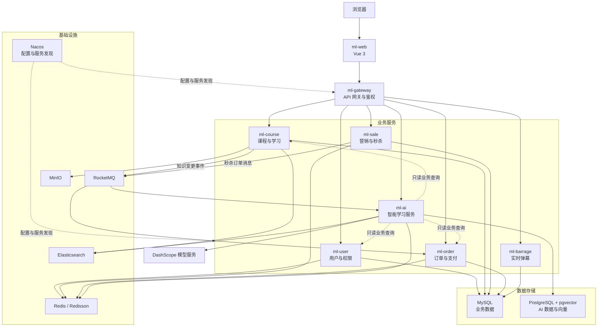

# MyLesson

MyLesson 是一个前后端分离的在线学习平台。后端采用 Spring Cloud Alibaba 微服务架构，前端基于 Vue 3 和 Element Plus，平台包含课程学习、内容管理、营销交易、订单支付、实时弹幕和智能学习服务。

## 功能

### 学习平台

- 用户注册、登录、角色权限和个人资料管理
- 课程分类、课程分集、学习记录、评论和收藏
- 公告、文章、Banner、优惠券和秒杀活动
- 购物车、订单、支付宝沙箱支付和支付回调
- WebSocket 弹幕、MinIO 媒体存储和 Elasticsearch 检索

### 智能学习服务

- 知识问答：检索课程及分集内容，回答中携带来源引用，证据不足时返回拒答结果
- 课程推荐：根据学习目标检索和排序课程，并结合当前用户的学习数据生成建议
- 个人查询：查询当前登录用户的资料、订单、购物车和学习计划
- 学习计划：生成可调整的版本化草案，用户确认后创建正式计划

## 系统架构



所有后端服务注册到 Nacos，客户端请求统一通过 Gateway 进入。业务服务使用 MySQL，智能学习服务使用 PostgreSQL 和 pgvector；服务间事件通过 RocketMQ 传递。

## 模块

| 模块 | 端口 | 说明 |
| --- | ---: | --- |
| `ml-gateway` | 24101 | API 网关、鉴权和用户身份透传 |
| `ml-user` | 24102 | 用户、角色和权限管理 |
| `ml-course` | 24103 | 课程、分集和学习内容 |
| `ml-sale` | 24104 | 营销、优惠券和秒杀 |
| `ml-order` | 24105 | 购物车、订单和支付 |
| `ml-barrage` | 24106 | 实时弹幕服务 |
| `ml-ai` | 24107 | 智能问答、课程推荐和学习计划 |
| `ml-web` | 24108 | Vue 3 Web 应用 |

## 技术栈

### 后端

- Java 17、Spring Boot、Spring Cloud、Spring Cloud Alibaba
- Nacos、OpenFeign、Sentinel
- MyBatis-Flex、MySQL、PostgreSQL、pgvector
- Redis、Redisson、RocketMQ、Elasticsearch
- MinIO、WebSocket、XXL-JOB
- Spring AI Alibaba、DashScope、Spring AI Alibaba Graph

### 前端

- Vue 3、Vue Router、Vuex
- Vite、Element Plus
- Axios、ECharts、xgplayer

## 目录结构

```text
my-lesson/
|-- ml-common/       公共模型、工具和安全上下文
|-- ml-generator/    代码生成模块
|-- ml-gateway/      API 网关
|-- ml-user/         用户与权限服务
|-- ml-course/       课程与学习服务
|-- ml-sale/         营销与秒杀服务
|-- ml-order/        订单与支付服务
|-- ml-barrage/      弹幕服务
|-- ml-ai/           智能学习服务
|-- ml-web/          Vue 3 前端
|-- demo-data/       本地演示数据和资源
|-- .github/         GitHub Actions 工作流
|-- NACOS_CONFIG.md  Nacos 配置说明
`-- pom.xml          Maven 聚合配置
```

## 环境要求

- JDK 17
- Maven 3.9+
- Node.js 20+
- Nacos
- MySQL 8
- PostgreSQL 15+ 与 pgvector
- Redis
- Elasticsearch
- RocketMQ
- MinIO
- DashScope API Key

## 快速开始

### 1. 准备配置

以 `.env.example` 为环境变量清单，通过本地环境、IDE 启动配置或容器编排注入实际值。不要向 Git 提交密码、令牌、API Key 或私钥。

常用变量：

```dotenv
NACOS_SERVER_ADDR=127.0.0.1:8848
MYSQL_USERNAME=root
MYSQL_PASSWORD=change-me
AI_DATASOURCE_URL=jdbc:postgresql://127.0.0.1:5432/mylesson_ai
AI_DATASOURCE_USERNAME=postgres
AI_DATASOURCE_PASSWORD=change-me
REDIS_HOST=127.0.0.1
ROCKETMQ_NAME_SERVER=127.0.0.1:9876
ELASTICSEARCH_URIS=http://127.0.0.1:9200
DASHSCOPE_API_KEY=change-me
AI_CHAT_MODEL=qwen3-max
AI_ROUTER_MODEL=qwen-flash
AI_IDENTITY_SECRET=generate-at-least-32-random-bytes
AI_INTERNAL_TOKEN=generate-at-least-32-random-bytes
```

在 Nacos 中创建 `ml-group` 分组并导入各服务配置。Data ID、配置模板和敏感信息注入方式见 [NACOS_CONFIG.md](NACOS_CONFIG.md)。

### 2. 准备数据库

业务服务使用以下 MySQL Schema：

```text
ml_ums  用户
ml_cms  课程
ml_sms  营销
ml_oms  订单
ml_bms  弹幕
```

智能学习服务使用 PostgreSQL 数据库 `mylesson_ai`。`ml-ai` 启动时会通过 Flyway 自动执行 `ml-ai/src/main/resources/db/migration` 下的迁移。

### 3. 构建后端

在项目根目录执行：

```powershell
mvn clean install -DskipTests
```

### 4. 启动后端

基础设施和 Nacos 配置准备完成后，在独立终端中依次启动业务服务、Gateway 和 AI 服务：

```powershell
mvn -pl ml-user spring-boot:run
mvn -pl ml-course spring-boot:run
mvn -pl ml-sale spring-boot:run
mvn -pl ml-order spring-boot:run
mvn -pl ml-barrage spring-boot:run
mvn -pl ml-gateway spring-boot:run
mvn -pl ml-ai spring-boot:run
```

### 5. 启动前端

```powershell
Set-Location ml-web
npm ci
npm run dev
```

### 6. 访问服务

| 地址 | 用途 |
| --- | --- |
| `http://localhost:24108` | Web 应用 |
| `http://localhost:24101` | Gateway API |
| `http://localhost:24107/swagger-ui.html` | AI Swagger UI |
| `http://localhost:24107/v3/api-docs` | AI OpenAPI JSON |
| `http://localhost:24107/actuator/health` | AI 健康检查 |

## AI 服务设计

### Agent 路由

AI 服务先识别请求场景，再为 Agent 装配对应的只读工具。工具调用中的用户身份由服务端上下文注入，不接收客户端传入的 `userId`。模型调用和工具调用均设置超时、重试和次数上限。

### 混合检索

```text
查询改写
 -> PostgreSQL/pgvector 向量召回
 -> Elasticsearch 关键词召回
 -> RRF 融合
 -> Rerank
 -> 相关性校验
 -> 引用映射或拒答
```

向量检索和关键词检索可独立降级。检索过程记录查询改写、候选数量、重排状态、最终命中和分阶段耗时。

### 学习计划

```text
目标标准化 -> 用户资料 -> 课程检索 -> 课程核验 -> 候选质量检查
 -> Designer 生成草案 -> Java 规则校验 -> Reviewer 审查
 -> 草案修正 -> 保存版本 -> 等待用户确认 -> 创建正式计划
```

用户调整会生成新版本。确认操作采用条件更新，防止同一草案被重复确认。

### 知识同步

课程服务通过 Outbox 记录知识变更事件，Relay 将事件投递到 RocketMQ。AI 消费端使用 Inbox 对 `eventId` 去重，并根据 `version` 忽略乱序旧事件。

## 测试

运行全部后端测试：

```powershell
mvn test
```

运行 AI 模块测试：

```powershell
mvn -pl ml-ai test
```

构建前端：

```powershell
Set-Location ml-web
npm ci
npm run build
```

AI 评测支持 `deterministic` 和 `external` 两种模式。`external` 模式会连接真实模型、检索存储和业务服务，适合在依赖完整的测试环境中执行。

GitHub Actions 会在 push 和 pull request 时执行后端打包、前端依赖审计和前端构建。

## 主要 AI API

```text
POST /api/v1/ai/conversations/{id}/messages
GET  /api/v1/ai/conversations/{id}/stream
POST /api/v1/ai/course-recommendations
GET  /api/v1/ai/learning-plan-drafts
POST /api/v1/ai/learning-plan-drafts/{id}/adjustments
POST /api/v1/ai/learning-plan-drafts/{id}/confirm
POST /api/v1/ai/learning-plan-drafts/{id}/cancel
GET  /api/v1/ai/plans
PATCH /api/v1/ai/plans/{id}/progress
POST /api/v1/ai/admin/evaluations/run
GET  /api/v1/ai/admin/evaluations/{id}
```

## 安全说明

- 不要提交 `.env`、密码、访问令牌、API Key 或支付私钥
- 生产环境必须替换示例密钥，并限制 Nacos、数据库和中间件的公网访问
- AI 用户身份由 Gateway 签名透传，业务工具不接受客户端指定其他用户身份

## License

本项目使用 [MIT License](LICENSE)。
